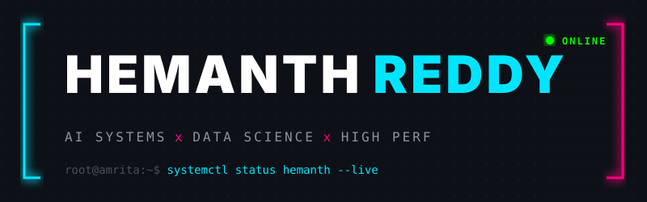

  

    
  
  whoami • experience • research • telemetry

 

# Hi, I'm Hemanth Reddy

**AI & Data Engineer who builds end-to-end.** B.Tech in AI & Data Science (Class of 2028) at Amrita Vishwa Vidyapeetham. My work bridges the gap between theoretical machine learning and production-ready systems. I focus on big data pipelines, distributed machine learning ensembles, and high-performance computing — and I build the robust infrastructure that scales them: real-time streaming architectures, GPU-accelerated execution engines, and low-latency REST APIs. 

**Currently:** Architecting an adaptive GPU-accelerated graph processing engine in C++ and CUDA.
**Focus:** Machine Learning, Distributed Systems, Big Data Infrastructure, High-Performance Computing.

---

## Experience & Internships

**AI & Data Science Intern @ XYlofy AI** 
Built an end-to-end real-time fraud detection system to identify suspicious financial transactions using explainable AI. Processed 590K+ transactions with 400+ features, handling significant missing data and severe class imbalance using SMOTE. Optimized classification thresholds across LightGBM, XGBoost, and Isolation Forest models to maximize detection accuracy. Applied SHAP for model interpretability and deployed an interactive Streamlit dashboard for real-time fraud risk analysis.

---

## Projects & Research

My work spans distributed data processing and applied AI — the common thread is **building scalable systems that solve complex technical challenges**.

| Work | Tech Stack |
| :--- | :--- |
| **Real-Time Fraud Detection System** — End-to-end pipeline processing 590K+ transactions with explainable AI (SHAP) and SMOTE for severe class imbalance. Optimized LightGBM and XGBoost thresholds. | Python, LightGBM, XGBoost, Streamlit |
| **AI Cyberattack Detection (SDN-OSHLD)** — Real-time network intrusion detection achieving 99.2% accuracy on the CICIDS2017 benchmark, served via a sub-100ms FastAPI backend. | Python, Scikit-learn, FastAPI, Docker |
| **Big Data Taxi Demand & ETA Prediction** — Distributed pipeline processing 17GB+ (11M+ records) with integrated Kafka streaming and weather data for real-time hourly demand prediction. | Hadoop, Apache Spark, Scala, Kafka |
| **Adaptive GPU Graph Engine** — High-performance graph processing (BFS, PageRank) that dynamically schedules execution across CPU and GPU hardware based on graph topology. | C++, CUDA, OpenMP, MPI |
| **AQTrust: Quantum-Cloud Verification** — Quantum-cloud verification framework using hidden trap circuits to ensure computation integrity, simulating 20,000 sessions per policy. | Python, Qiskit, Qiskit Aer |

 

### `root@amrita:~$ htop -u hemanth`

  
  

