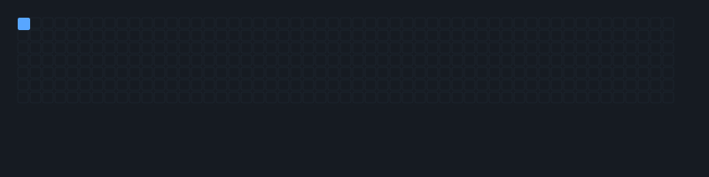

  
   
  <code>[STATUS: ONLINE]</code> | <code>[ROLE: AI & DATA ENGINEER]</code> | <code>[LOCATION: AMRITA VISHWA VIDYAPEETHAM]</code>
    

---

### 🖧 `CORE_PROCESSING_UNIT`
> **MISSION DIRECTIVE:** Bridge the gap between theoretical machine learning and production-ready systems.

I am architecting the infrastructure that allows machine learning models to scale—from real-time streaming architectures to GPU-accelerated execution engines and low-latency REST APIs. 

  <table>
    <tr>
      <td width="50%" align="center">
        <b>[CURRENT_FOCUS]</b> 
        <i>Adaptive GPU-accelerated graph processing engine in C++ and CUDA.</i>
      </td>
      <td width="50%" align="center">
        <b>[SYSTEM_PHILOSOPHY]</b> 
        <i>Scalability by default, hardware-aware execution, and data-driven architecture.</i>
      </td>
    </tr>
  </table>

---

### 📡 `TELEMETRY_&_METRICS`

  <!-- Custom Interactive Builder Contribution Graph -->
  <picture>
    
  </picture>
    
  
  

 

---

### ⚙️ `ARSENAL_SUBSYSTEMS`

  
  
  
  
  
  
  
  
  
  

---

### 🚀 `ACTIVE_DIRECTIVES`
| Subsystem | Tech Stack | Status |
| :--- | :--- | :--- |
| **`[Fraud_Detection_AI]`**   Handled severe class imbalance using SMOTE and evaluated LightGBM, XGBoost, and Isolation Forest. Shipped a Streamlit risk dashboard. | LightGBM, XGBoost, Streamlit | `[DEPLOYED]` |
| **`[SDN-OSHLD_Cyberattack]`**   Real-time network intrusion detection achieving **99.2% accuracy** on CICIDS2017 benchmark. | Python, Scikit-learn, FastAPI | `[ONLINE]` |
| **`[Big_Data_Taxi_Pipeline]`**   Distributed pipeline processing **17GB+** (11M+ records). Integrated Kafka streaming and Spark MLlib. | Hadoop, Spark, Scala, Kafka | `[ONLINE]` |
| **`[Adaptive_GPU_Graph_Engine]`**   High-performance graph processing that dynamically schedules execution across CPU and GPU hardware. | C++, CUDA, OpenMP, MPI | `[ACTIVE]` |

---

### 🔗 `ESTABLISH_CONNECTION`

   
  
  
  

 
